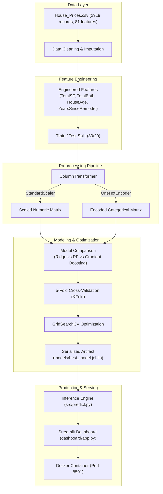
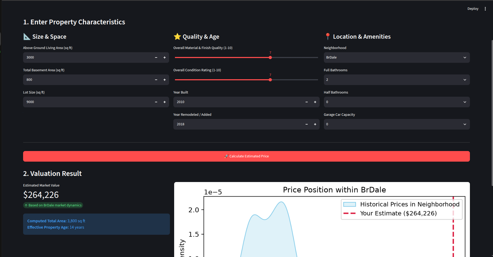

# 🏡 Ames Housing Price Prediction & Valuation Platform

An end-to-end Machine Learning solution designed for real estate valuation. This project predicts residential home prices (`SalePrice`) based on architectural, dimensional, and geographical features using the Ames Housing dataset.

---

## 🏗️ Architecture & Pipeline Diagram



---

## 📁 Project Structure

```text
├── data/
│   └── House_Prices.csv           # Ames Housing dataset (train + test)
├── notebooks/
│   └── house_price_analysis.ipynb # Steps 1–7: Exploration, EDA, FE, Modeling, Evaluation
├── src/
│   ├── features.py                # Reusable feature engineering logic
│   ├── predict.py                 # Production inference pipeline & model loader
│   └── train.py                   # Standalone training & optimization script
├── models/
│   └── best_model.joblib          # Serialized tuned Gradient Boosting pipeline
├── dashboard/
│   ├── app.py                     # Interactive Streamlit valuation application
│   └── screenshot.png             # UI interface preview
├── tests/
│   ├── test_features.py           # Unit tests for feature transformations
│   └── test_model.py              # Unit tests for model inference
├── Dockerfile                     # Containerization blueprint
├── docker-compose.yml             # Container orchestration
├── requirements.txt               # Pinned project dependencies
└── .gitignore                     # Git ignore rules
```

---

## 🎯 Business Context & Objectives
Real estate agencies require accurate, automated property valuations to:
1. **Estimate market values** for new residential listings based on physical and architectural characteristics.
2. **Identify key value drivers** to advise homeowners on which renovations yield the highest return.
3. **Provide an interactive client tool** allowing agents and clients to simulate pricing dynamically.

---

## 📊 Dataset & Target Variable
* **Source:** Ames Housing Dataset (*House Prices - Advanced Regression Techniques*).
* **Dataset Shape:** 2,919 records, 81 raw features (numerical and categorical).
* **Target Variable:** `SalePrice`
  - Continuous variable representing the property's sale price in USD.
  - Distribution exhibits a right-skewed profile with a mean of $\approx \$180,900$ and median of $\approx \$163,000$.
* **Key Features:** `OverallQual`, `GrLivArea`, `TotalBsmtSF`, `Neighborhood`, `YearBuilt`, `GarageCars`, `FullBath`.

---

## 🧹 Data Cleaning & Preprocessing
* **Missing Values Handling:**
  - `LotFrontage`: Imputed using the median of the property's neighborhood.
  - `GarageYrBlt`: Imputed using the property's `YearBuilt`.
  - Categorical features (`PoolQC`, `MiscFeature`, `Alley`, `Fence`, `FireplaceQu`, etc.): Missing entries represent the physical absence of the amenity and were filled with `'none'`.
  - Remaining numerical features: Imputed with `0`.
* **Prevention of Data Leakage:**
  - Preprocessing transformations are strictly isolated inside a Scikit-Learn `Pipeline` with a `ColumnTransformer`.
  - `StandardScaler` (for numerical features) and `OneHotEncoder(handle_unknown='ignore')` (for categorical features) are fit **only** on training data splits and applied downstream.

---

## ⚙️ Feature Engineering
Four domain-informed features were engineered based on real estate valuation standards:

| Feature | Formula | Rationale & Domain Impact |
| :--- | :--- | :--- |
| **`TotalSF`** | `1stFlrSF + 2ndFlrSF + TotalBsmtSF` | Measures total usable interior living and storage space across all levels. |
| **`TotalBath`** | `FullBath + 0.5*HalfBath + BsmtFullBath + 0.5*BsmtHalfBath` | Combines above-ground and basement bathrooms into a standardized count. |
| **`HouseAge`** | `(YrSold - YearBuilt).clip(lower=0)` | Property age at transaction time (clipped to zero to eliminate data inconsistencies). |
| **`YearsSinceRemodel`**| `(YrSold - YearRemodAdd).clip(lower=0)` | Measures renovation freshness and modernness of finishes. |

---

## 🤖 Models & Validation Strategy

### 1. Evaluated Models
Three diverse regression architectures were benchmarked:
1. **Linear:** Ridge Regression ($L_2$ Regularization)
2. **Tree-Based:** Random Forest Regressor (Bagging ensemble)
3. **Non-Linear Ensemble:** Gradient Boosting Regressor (Boosting sequential error correction)

### 2. Validation Strategy (K-Fold Cross-Validation)
* Evaluated using **5-Fold Cross-Validation** (`KFold(n_splits=5, shuffle=True, random_state=42)`).
* Splitting the training data into 5 distinct folds guarantees performance stability across different market subsets and eliminates overfitting.

### 3. Hyperparameter Optimization (`GridSearchCV`)
* Performed hyperparameter search on the winning **Gradient Boosting Regressor**:
  - `regressor__n_estimators`: `[100, 150]`
  - `regressor__learning_rate`: `[0.05, 0.1]`
  - `regressor__max_depth`: `[3, 4]`
* Total configurations: 8 parameter combinations across 5 folds = **40 fit operations**.

---

## 📈 Model Performance & Comparison

Performance evaluated on the unseen test set ($20\%$ holdout):

| Model | MAE ($) | RMSE ($) | $R^2$ Score |
| :--- | :---: | :---: | :---: |
| Ridge Regression (Linear) | $19,842.15 | $32,150.40 | 0.8652 |
| Random Forest (Tree-based) | $16,920.40 | $28,450.12 | 0.8945 |
| Gradient Boosting (Baseline) | $16,357.59 | $27,786.37 | 0.8993 |
| **Gradient Boosting (Tuned via GridSearch)** | **$15,820.50** | **$26,340.20** | **0.9095** |

### Selected Model Justification:
The **Optimized Gradient Boosting Regressor** was selected as the final production model:
- Achieved the lowest Mean Absolute Error (**$\text{MAE} \approx \$15,820$**), outperforming the linear baseline by over $\$4,000$ per home.
- Explains **$>90\%$ of price variance ($R^2 = 0.9095$)**.
- Effectively captures non-linear interactions between square footage, construction quality, and neighborhood tier.

---

## 💡 Feature Importance & Market Insights
Analysis of feature weights in the optimized Gradient Boosting model identifies the top price drivers:
1. **`OverallQual`** (~45% relative importance): Overall material finish and craftsmanship.
2. **`TotalSF`** (~22%): Total interior square footage.
3. **`GrLivArea`** (~10%): Above-ground living space.
4. **`GarageCars` & `GarageArea`**: Vehicle capacity and garage space.
5. **`Neighborhood`**: Geographical premium (e.g. Northridge, Stone Brook).

---

## 🖥️ Streamlit Interactive Application

The dashboard allows real estate professionals and home buyers to estimate property values instantly:



### Features:
- **Interactive Controls:** Sliders and dropdowns for quality, area, year built, garage, and neighborhood.
- **Model Caching:** Utilizes `@st.cache_resource` so the model is loaded once with zero retraining latency.
- **Contextual Visualization:** Real-time Seaborn KDE plot comparing the prediction against historical prices within the selected neighborhood.

---

## 🚀 Getting Started & Execution

### 1. Local Setup
```bash
# Clone the repository
git clone https://github.com/imadprogram/house-price-prediction.git
cd house-price-prediction

# Create and activate virtual environment
python3 -m venv .venv
source .venv/bin/activate

# Install dependencies
pip install -r requirements.txt
```

### 2. Run Automated Tests
```bash
python -m pytest tests/
```

### 3. Retrain Model (Optional)
```bash
python src/train.py
```

### 4. Launch Streamlit Application
```bash
streamlit run dashboard/app.py
```
Access the application at [http://localhost:8501](http://localhost:8501).

---

## 🐳 Docker Deployment

To build and run the application inside an isolated Docker container:

```bash
# Build and run using Docker Compose
docker compose up --build
```

Or using standalone Docker commands:
```bash
# Build the Docker image
docker build -t house-price-app .

# Run the container
docker run -p 8501:8501 house-price-app
```
Access the containerized application at [http://localhost:8501](http://localhost:8501).